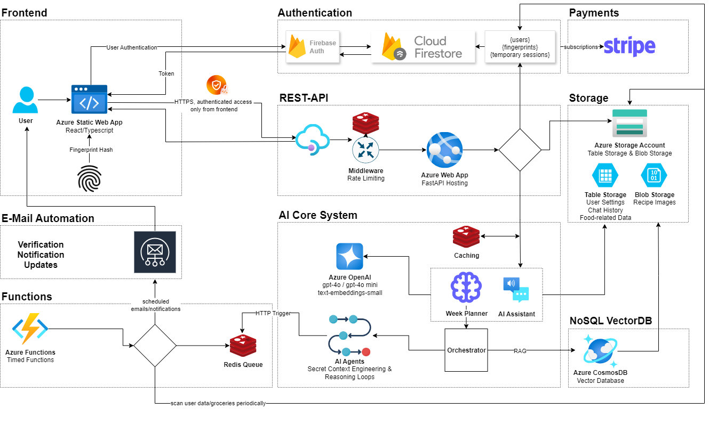

# FoodFusionAI

**Your Personal AI-Powered Nutrition & Meal Planning Assistant**

Generate complete weekly meal plans with recipes and shopping lists in just 60 seconds, perfectly tailored to your lifestyle, dietary preferences, and fitness goals.

## 🚀 Quick Links

- **[🎯 Landing Page](https:/foodfusionai.de)** - Learn more about features
- **[📱 Web App](https:/app.foodfusionai.de)** - Start planning your meals now

---

## 🎥 Demo Video

TODO

*See how FoodFusionAI transforms meal planning in under 60 seconds!*

## ✨ What is FoodFusionAI?

FoodFusionAI is an intelligent web application that revolutionizes meal planning by combining artificial intelligence with personalized nutrition science. Our platform generates complete weekly meal plans tailored to your unique preferences, dietary requirements, and fitness goals - all in just 60 seconds.

### 🎯 Key Features

- **⚡ 60-Second Meal Planning** - Complete weekly plans generated instantly
- **🥗 Personalized Nutrition** - Tailored to your dietary style and preferences
- **🏃‍♂️ Fitness Integration** - Meal plans adapted to your activity level
- **⏰ Time-Conscious Cooking** - Recipes matched to your available cooking time
- **🛒 Smart Shopping Lists** - Automatically generated grocery lists
- **🤖 AI Nutrition Assistant** - Your personal nutrition expert available 24/7
- **📊 Inventory Tracking** - AI knows what you have and suggests accordingly
- **🔄 Adaptive Planning** - Plans evolve with your changing needs

## 🏗️ Architecture Overview

## Infrastructure & Services
| Service | Purpose | Tech |
| ----------- | ----------- | ----------- |
| **Firebase Authentication** | User authentication & management |  |
| **Firebase Firestore** | Real-time user data synchronization |  |
| **Azure Web App** | API & backend logic |  |
| **Azure CosmosDB** | NoSQL vector database for AI embeddings |  |
| **Azure Table Storage** | Chat history, user settings, groceries data |  |
| **Azure Blob Storage** | Recipe images & media files |  |
| **Azure Functions** | HTTP & Timed Triggers |  |
| **Redis** | Caching, rate limiting, job queues |  |

## 🔒 Privacy & Security

- **Data Encryption**: Only authenticated users can access protected resources
- **Privacy First**: No personal data shared with third parties
- **GDPR Compliant**: Full compliance with data protection regulations
- **Secure Authentication**: JWT tokens with automatic expiration

## 📞 Contact

**📧 Email**: kontakt@foodfusionai.de

---

**Made with ❤️ by the FoodFusionAI Team**

*Transforming the way the world thinks about meal planning.*

